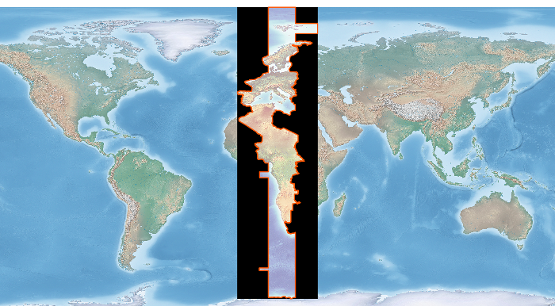

Layers
=============

Is Ogr Installed
-------------------

.. code-block:: python

    try:
      from osgeo import ogr
      print 'Import of ogr from osgeo worked.  Hurray!\n'
    except:
      print 'Import of ogr from osgeo failed\n\n'

View Auto Generated Ogr Help
------------------------------      
    This code simply prints out the auto-generated help on the imported module.  In this case it's OGR.

.. code-block:: python
    
    import osgeo.ogr
    print help(osgeo.ogr)

Get List of Ogr Drivers Alphabetically (A- Z)
-----------------------------------------------

    It's always driven me a little nuts that the command line ogr2ogr --formats returns a 'random' list of drivers.  This code returns the list of OGR drivers alphabetically from A - Z.  .  
   
.. code-block:: python

    import ogr
    cnt = ogr.GetDriverCount()
    formatsList = []  # Empty List

    for i in range(cnt):
        driver = ogr.GetDriver(i)
        driverName = driver.GetName()
        if not driverName in formatsList:
            formatsList.append(driverName)

    formatsList.sort() # Sorting the messy list of ogr drivers 

    for i in formatsList:
        print i
     
Is Ogr Driver Available by Driver Name
--------------------------------------------      
    This code shows if a particular OGR driver is available.  The exact names are the ones used on the OGR Vector Formats page in the "Code" column  ([`formats website <http://www.gdal.org/ogr/ogr_formats.html>`_]).  This is the same names returned when you enter ``ogrinfo --formats`` on the command line.  
    
    Code Example Source: [`website <http://www.gdal.org/ogr/ogr_apitut.html>`_]
    
.. code-block:: python
    
    from osgeo import ogr
    
    ## Shapefile available?
    driverName = "ESRI Shapefile"
    drv = ogr.GetDriverByName( driverName )
    if drv is None:
        print "%s driver not available.\n" % driverName
    else:
        print  "%s driver IS available.\n" % driverName
        
    ## PostgreSQL available?
    driverName = "PostgreSQL"
    drv = ogr.GetDriverByName( driverName )
    if drv is None:
        print "%s driver not available.\n" % driverName
    else:
        print  "%s driver IS available.\n" % driverName
        
    ## Is File GeoDatabase available?
    driverName = "FileGDB"
    drv = ogr.GetDriverByName( driverName )
    if drv is None:
        print "%s driver not available.\n" % driverName
    else:
        print  "%s driver IS available.\n" % driverName
        
    ## SDE available?
    driverName = "SDE"
    drv = ogr.GetDriverByName( driverName )
    if drv is None:
        print "%s driver not available.\n" % driverName
    else:
        print  "%s driver IS available.\n" % driverName
        
        
Get Shapefile Feature Count
-------------------------------
    This code example opens a shapefile and returns the number of features in it.  Solution mined from: [`web site <http://www.gis.usu.edu/~chrisg/python/2009/lectures/ospy_slides1.pdf>`_] 

.. code-block:: python

    import os
    from osgeo import ogr

    daShapefile = r"C:\Temp\Voting_Centers_and_Ballot_Sites.shp"

    driver = ogr.GetDriverByName('ESRI Shapefile')

    dataSource = driver.Open(daShapefile, 0) # 0 means read-only. 1 means writeable.

    # Check to see if shapefile is found.
    if dataSource is None:
        print 'Could not open %s' % (daShapefile)
    else:
        print 'Opened %s' % (daShapefile)
        layer = dataSource.GetLayer()
        featureCount = layer.GetFeatureCount()  
        print "Number of features in %s: %d" % (os.path.basename(daShapefile),featureCount)

        
    
Get All PostGIS layers in a PostgreSQL Database
--------------------------------------------------

    This returns all the layers in a database of your choosing sorted in alphabetical order (of course).  Just fill in the missing information and it should work.  
    
.. code-block:: python

    from osgeo import ogr

    databaseServer = "<IP of database server OR Name of database server"
    databaseName = "<Name of database>"
    databaseUser = "<User name>"
    databasePW = "<User password>"

    connString = "PG: host=%s dbname=%s user=%s password=%s" %(databaseServer,databaseName,databaseUser,databasePW)

    conn = ogr.Open(connString)

    layerList = []
    for i in conn:
        daLayer = i.GetName()
        if not daLayer in layerList:
            layerList.append(daLayer)

    layerList.sort()

    for j in layerList:
        print j
        
    conn.Destroy()

Get PostGIS Layer Feature Count By Layer Name
------------------------------------------------
    This code example opens a postgis connection and gets the specified layer name if it exists in the database. Otherwise it throws a nice error message

.. code-block:: python

    from osgeo import ogr
    import sys

    databaseServer = "<IP of database server OR Name of database server"
    databaseName = "<Name of database>"
    databaseUser = "<User name>"
    databasePW = "<User password>"
    connString = "PG: host=%s dbname=%s user=%s password=%s" % (databaseServer,databaseName,databaseUser,databasePW)

    def GetPGLayer( lyr_name ):
        conn = ogr.Open(connString)

        lyr = conn.GetLayer( lyr_name )
        if lyr is None:
            print >> sys.stderr, '[ ERROR ]: layer name = "%s" could not be found in database "%s"' % ( lyr_name, databaseName )
            sys.exit( 1 )

        featureCount = lyr.GetFeatureCount()
        print "Number of features in %s: %d" % ( lyr_name , featureCount )

        conn.Destroy()

    if __name__ == '__main__':
        
        if len( sys.argv ) < 2:
            print >> sys.stderr, '[ ERROR ]: you must pass at least one argument -- the layer name argument'
            sys.exit( 1 )
        
        lyr_name = sys.argv[1]
        GetPGLayer( lyr_name )

        
Iterate over Features
------------------------
 
.. code-block:: python

    from osgeo import ogr
    import os

    shapefile = "states.shp"
    driver = ogr.GetDriverByName("ESRI Shapefile")
    dataSource = driver.Open(shapefile, 0)
    layer = dataSource.GetLayer()

    for feature in layer:
        print feature.GetField("STATE_NAME")

Get Geometry from each Feature in a Layer
--------------------------------------------

.. code-block:: python

    from osgeo import ogr
    import os

    shapefile = "states.shp"
    driver = ogr.GetDriverByName("ESRI Shapefile")
    dataSource = driver.Open(shapefile, 0)
    layer = dataSource.GetLayer()

    for feature in layer:
        geom = feature.GetGeometryRef()
        print geom.Centroid().ExportToWkt()

Filter by attribute
----------------------
 
.. code-block:: python  
     
    from osgeo import ogr
    import os

    shapefile = "states.shp"
    driver = ogr.GetDriverByName("ESRI Shapefile")
    dataSource = driver.Open(shapefile, 0)
    layer = dataSource.GetLayer()

    layer.SetAttributeFilter("SUB_REGION = 'Pacific'")

    for feature in layer:
        print feature.GetField("STATE_NAME")

Spatial Filter
-----------------

.. code-block:: python  

    from osgeo import ogr
    import os

    shapefile = "states.shp"
    driver = ogr.GetDriverByName("ESRI Shapefile")
    dataSource = driver.Open(shapefile, 0)
    layer = dataSource.GetLayer()

    wkt = "POLYGON ((-103.81402655265633 50.253951270672125,-102.94583419409656 51.535568561879401,-100.34125711841725 51.328856095555651,-100.34125711841725 51.328856095555651,-93.437060743203844 50.460663736995883,-93.767800689321859 46.450441890315041,-94.635993047881612 41.613370178339181,-100.75468205106476 41.365315218750681,-106.12920617548238 42.564247523428456,-105.96383620242338 47.277291755610058,-103.81402655265633 50.253951270672125))"
    layer.SetSpatialFilter(ogr.CreateGeometryFromWkt(wkt))

    for feature in layer:
        print feature.GetField("STATE_NAME")

Get Shapefile Fields - Get the user defined fields
------------------------------------------------------
 
    This code example returns the field names of the user defined (created) fields.  

.. code-block:: python
    
    from osgeo import ogr
    
    daShapefile = r"C:\Temp\Voting_Centers_and_Ballot_Sites.shp"

    dataSource = ogr.Open(daShapefile)
    daLayer = dataSource.GetLayer(0)
    layerDefinition = daLayer.GetLayerDefn()

    for i in range(layerDefinition.GetFieldCount()):
        print layerDefinition.GetFieldDefn(i).GetName() 

        
        
Get Shapefile Fields and Types - Get the user defined fields
----------------------------------------------------------------

     This code example returns the field names of the user defined (created) fields and the data types they are.
     
.. code-block:: python    

    from osgeo import ogr

    daShapefile = r"C:\Temp\iDay\CWI_Wetlands.shp"

    dataSource = ogr.Open(daShapefile)
    daLayer = dataSource.GetLayer(0)
    layerDefinition = daLayer.GetLayerDefn()

    print "Name  -  Type  Width  Precision"
    for i in range(layerDefinition.GetFieldCount()):
        fieldName =  layerDefinition.GetFieldDefn(i).GetName()
        fieldTypeCode = layerDefinition.GetFieldDefn(i).GetType()
        fieldType = layerDefinition.GetFieldDefn(i).GetFieldTypeName(fieldTypeCode)
        fieldWidth = layerDefinition.GetFieldDefn(i).GetWidth()
        GetPrecision = layerDefinition.GetFieldDefn(i).GetPrecision()

        print fieldName + " - " + fieldType+ " " + str(fieldWidth) + " " + str(GetPrecision)  
 

Get PostGIS Layer Fields - Get the user defined fields
---------------------------------------------------------
 
    This code example returns the field names of the user defined (created) fields.  

.. code-block:: python

    from osgeo import ogr
    import sys

    databaseServer = "<IP of database server OR Name of database server"
    databaseName = "<Name of database>"
    databaseUser = "<User name>"
    databasePW = "<User password>"
    connString = "PG: host=%s dbname=%s user=%s password=%s" %(databaseServer,databaseName,databaseUser,databasePW)

    def GetPGLayerFields( lyr_name ):
        conn = ogr.Open(connString)

        lyr = conn.GetLayer( lyr_name )
        if lyr is None:
            print >> sys.stderr, '[ ERROR ]: layer name = "%s" could not be found in database "%s"' % ( lyr_name, databaseName )
            sys.exit( 1 )

        lyrDefn = lyr.GetLayerDefn()

        for i in range( lyrDefn.GetFieldCount() ):
            print lyrDefn.GetFieldDefn( i ).GetName()

        conn.Destroy()

    if __name__ == '__main__':
        
        if len( sys.argv ) < 2:
            print >> sys.stderr, '[ ERROR ]: you must pass at least one argument -- the layer name argument'
            sys.exit( 1 )
        
        lyr_name = sys.argv[1]
        GetPGLayerFields( lyr_name )

Get PostGIS Layer Fields and Types - Get the user defined fields
---------------------------------------------------------------------

     This code example returns the field names of the user defined (created) fields and the data types they are.
     
.. code-block:: python    

    from osgeo import ogr
    import sys

    databaseServer = "<IP of database server OR Name of database server"
    databaseName = "<Name of database>"
    databaseUser = "<User name>"
    databasePW = "<User password>"
    connString = "PG: host=%s dbname=%s user=%s password=%s" %(databaseServer,databaseName,databaseUser,databasePW)

    def GetPGLayerFieldTypes( lyr_name ):
        conn = ogr.Open(connString)

        lyr = conn.GetLayer( lyr_name )
        if lyr is None:
            print >> sys.stderr, '[ ERROR ]: layer name = "%s" could not be found in database "%s"' % ( lyr_name, databaseName )
            sys.exit( 1 )

        lyrDefn = lyr.GetLayerDefn()
        for i in range( lyrDefn.GetFieldCount() ):
            fieldName =  lyrDefn.GetFieldDefn(i).GetName()
            fieldTypeCode = lyrDefn.GetFieldDefn(i).GetType()
            fieldType = lyrDefn.GetFieldDefn(i).GetFieldTypeName(fieldTypeCode)
            fieldWidth = lyrDefn.GetFieldDefn(i).GetWidth()
            GetPrecision = lyrDefn.GetFieldDefn(i).GetPrecision()

            print fieldName + " - " + fieldType+ " " + str(fieldWidth) + " " + str(GetPrecision)

        conn.Destroy()

    if __name__ == '__main__':
        
        if len( sys.argv ) < 2:
            print >> sys.stderr, '[ ERROR ]: you must pass at least one argument -- the layer name argument'
            sys.exit( 1 )
        
        lyr_name = sys.argv[1]
        GetPGLayerFieldTypes( lyr_name )
     
Read a CSV of Coordinates as an OGRVRTLayer
------------------------------------------------

GDAL/OGR has a `Virtual Format spec <http://www.gdal.org/ogr/drv_vrt.html>`_ that allows you to derive layers from flat tables such as a CSV -- it does a lot more than that too so go read about it. In the example below we are reading in a CSV with X,Y columns and values. That CSV file is wrapped by an XML file that describes it as an OGR layer. Below are all the necessary pieces and a script that reads the XML file and prints out point geometries.

Our CSV file named `example.csv` looks like this:

.. code-block:: bash

    ID,X,Y
    1,-127.234343,47.234325
    2,-127.003243,46.234343
    3,-127.345646,45.234324
    4,-126.234324,44.324234

Our OGRVRTLayer XML file called `example_wrapper.vrt` looks like this:

.. code-block:: bash

    <OGRVRTDataSource>
        <OGRVRTLayer name="example">
            <SrcDataSource>example.csv</SrcDataSource> 
            <SrcLayer>example</SrcLayer> 
            <GeometryType>wkbPoint</GeometryType> 
                <LayerSRS>WGS84</LayerSRS>
            <GeometryField encoding="PointFromColumns" x="X" y="Y"/> 
        </OGRVRTLayer>
    </OGRVRTDataSource>

Now let's print out the point geometries:

.. code-block:: python

    from osgeo import ogr
    ogr.UseExceptions()

    inDataSource = ogr.Open("example_wrapper.vrt")
    lyr = inDataSource.GetLayer('example')
    for feat in lyr:
        geom = feat.GetGeometryRef()
        print geom.ExportToWkt()

Create a new Layer from the extent of an existing Layer
----------------------------------------------------------   

.. image:: images/layer_extent.png

.. code-block:: python

    from osgeo import ogr
    import os

    # Get a Layer's Extent
    inShapefile = "states.shp"
    inDriver = ogr.GetDriverByName("ESRI Shapefile")
    inDataSource = inDriver.Open(inShapefile, 0)
    inLayer = inDataSource.GetLayer()
    extent = inLayer.GetExtent()

    # Create a Polygon from the extent tuple
    ring = ogr.Geometry(ogr.wkbLinearRing)
    ring.AddPoint(extent[0],extent[2]) 
    ring.AddPoint(extent[1], extent[2])
    ring.AddPoint(extent[1], extent[3])
    ring.AddPoint(extent[0], extent[3]) 
    ring.AddPoint(extent[0],extent[2]) 
    poly = ogr.Geometry(ogr.wkbPolygon)
    poly.AddGeometry(ring)

    # Save extent to a new Shapefile
    outShapefile = "states_extent.shp"
    outDriver = ogr.GetDriverByName("ESRI Shapefile")

    # Remove output shapefile if it already exists
    if os.path.exists(outShapefile):
        outDriver.DeleteDataSource(outShapefile)

    # Create the output shapefile
    outDataSource = outDriver.CreateDataSource(outShapefile)
    outLayer = outDataSource.CreateLayer("states_extent", geom_type=ogr.wkbPolygon)

    # Add an ID field
    idField = ogr.FieldDefn("id", ogr.OFTInteger)
    outLayer.CreateField(idField)

    # Create the feature and set values
    featureDefn = outLayer.GetLayerDefn()
    feature = ogr.Feature(featureDefn)
    feature.SetGeometry(poly)
    feature.SetField("id", 1)
    outLayer.CreateFeature(feature)

    # Close DataSource
    inDataSource.Destroy()
    outDataSource.Destroy()
    

Save centroids of input Layer to an output Layer
-----------------------------------------------------

Inspired by: http://www.kralidis.ca/blog/2010/04/28/batch-centroid-calculations-with-python-and-ogr/

.. image:: images/layer_centroids.png

.. code-block:: python

    from osgeo import ogr
    import os

    # Get the input Layer
    inShapefile = "states.shp"
    inDriver = ogr.GetDriverByName("ESRI Shapefile")
    inDataSource = inDriver.Open(inShapefile, 0)
    inLayer = inDataSource.GetLayer()

    # Create the output Layer
    outShapefile = "states_centroids.shp"
    outDriver = ogr.GetDriverByName("ESRI Shapefile")

    # Remove output shapefile if it already exists
    if os.path.exists(outShapefile):
        outDriver.DeleteDataSource(outShapefile)

    # Create the output shapefile
    outDataSource = outDriver.CreateDataSource(outShapefile)
    outLayer = outDataSource.CreateLayer("states_centroids", geom_type=ogr.wkbPoint)

    # Add input Layer Fields to the output Layer
    inLayerDefn = inLayer.GetLayerDefn()
    for i in range(0, inLayerDefn.GetFieldCount()):
        fieldDefn = inLayerDefn.GetFieldDefn(i)
        outLayer.CreateField(fieldDefn)

    # Get the output Layer's Feature Definition
    outLayerDefn = outLayer.GetLayerDefn()

    # Add features to the ouput Layer
    for i in range(0, inLayer.GetFeatureCount()):
        # Get the input Feature
        inFeature = inLayer.GetFeature(i)
        # Create output Feature
        outFeature = ogr.Feature(outLayerDefn)
        # Add field values from input Layer
        for i in range(0, outLayerDefn.GetFieldCount()):
            outFeature.SetField(outLayerDefn.GetFieldDefn(i).GetNameRef(), inFeature.GetField(i))
        # Set geometry as centroid    
        geom = inFeature.GetGeometryRef()
        centroid = geom.Centroid()
        outFeature.SetGeometry(centroid)
        # Add new feature to output Layer
        outLayer.CreateFeature(outFeature)

    # Close DataSources
    inDataSource.Destroy()
    outDataSource.Destroy()
    
Create a New Shapefile and Add Data
---------------------------------------

This recipe parses a delimited text file of volcano location data and creates a shapefile.
The CSV file ``volcano_data.txt`` contains the following fields, separated by a tab character (\\t):

*  Name
*  Region
*  Latitude
*  Longitude
*  Elevation

`Taken from The Geospatial Desktop book.`

.. code-block:: python

  # Parse a delimited text file of volcano data and create a shapefile 

  import osgeo.ogr as ogr 
  import osgeo.osr as osr

  # use a dictionary reader so we can access by field name
  reader = csv.DictReader(open("volcano_data.txt","rb"), 
      delimiter='\t',     
      quoting=csv.QUOTE_NONE)

  # set up the shapefile driver
  driver = ogr.GetDriverByName("ESRI Shapefile") 

  # create the data source
  data_source = driver.CreateDataSource("volcanoes.shp") 

  # create the spatial reference, WGS84
  srs = osr.SpatialReference() 
  srs.ImportFromEPSG(4326)

  # create the layer
  layer = data_source.CreateLayer("volcanoes", srs, ogr.wkbPoint) 

  # Add the fields we're interested in
  field_name = ogr.FieldDefn("Name", ogr.OFTString) 
  field_name.SetWidth(24) 
  layer.CreateField(field_name) 
  field_region = ogr.FieldDefn("Region", ogr.OFTString)
  field_region.SetWidth(24)
  layer.CreateField(field_region)
  layer.CreateField(ogr.FieldDefn("Latitude", ogr.OFTReal)) 
  layer.CreateField(ogr.FieldDefn("Longitude", ogr.OFTReal))
  layer.CreateField(ogr.FieldDefn("Elevation", ogr.OFTInteger)) 

  # Process the text file and add the attributes and features to the shapefile
  for row in reader: 
    # create the feature
    feature = ogr.Feature(layer.GetLayerDefn()) 
    # Set the attributes using the values from the delimited text file
    feature.SetField("Name", row['Name']) 
    feature.SetField("Region", row['Region'])
    feature.SetField("Latitude", row['Latitude'])
    feature.SetField("Longitude", row['Longitude'])
    feature.SetField("Elevation", row['Elev']) 

    # create the WKT for the feature using Python string formatting
    wkt = "POINT(%f %f)" %  (float(row['Longitude']) , float(row['Latitude'])) 

    # Create the point from the Well Known Txt
    point = ogr.CreateGeometryFromWkt(wkt)  

    # Set the feature geometry using the point
    feature.SetGeometry(point) 
    # Create the feature in the layer (shapefile)
    layer.CreateFeature(feature) 
    # Destroy the feature to free resources
    feature.Destroy() 

  # Destroy the data source to free resources
  data_source.Destroy() 
   

Filter and Select Input Shapefile to New Output Shapefile Like ogr2ogr CLI 
-----------------------------------------------------------------------------
The `ogr2ogr command line tool <http://www.gdal.org/ogr2ogr.html>`_ is an easy way to filter, reproject and trim columns in a shapefile. The workflow below shows how we can approximate the following ogr2ogr command with the OGR api using a decently large `parcel shapefile from King County GIS <http://www5.kingcounty.gov/sdc/Metadata.aspx?Layer=parcel_address>`_ .

.. code-block:: bash

    #
    # this command says read in "parcel_address.shp" and write out to "junkmob.shp" 
    # where "MINOR" column = 'HYDR' value and only output the "PIN" column
    #
    $ ogr2ogr -f "ESRI Shapefile" junkmob.shp -select pin -where "minor = 'HYDR'" parcel_address.shp

.. code-block:: python

    from osgeo import ogr 
    import os, sys

    def main( field_name_target ):
        # Get the input Layer
        inShapefile = "~/DATA/SHAPES/KC_ADMIN/parcel_address/parcel_address.shp"
        inDriver = ogr.GetDriverByName("ESRI Shapefile")
        inDataSource = inDriver.Open(inShapefile, 0)
        inLayer = inDataSource.GetLayer()
        inLayer.SetAttributeFilter("minor = 'HYDR'")

        # Create the output LayerS
        outShapefile = os.path.join( os.path.split( inShapefile )[0], "ogr_api_filter.shp" )
        outDriver = ogr.GetDriverByName("ESRI Shapefile")

        # Remove output shapefile if it already exists
        if os.path.exists(outShapefile):
            outDriver.DeleteDataSource(outShapefile)

        # Create the output shapefile
        outDataSource = outDriver.CreateDataSource(outShapefile)
        out_lyr_name = os.path.splitext( os.path.split( outShapefile )[1] )[0]
        outLayer = outDataSource.CreateLayer( out_lyr_name, geom_type=ogr.wkbMultiPolygon )

        # Add input Layer Fields to the output Layer if it is the one we want
        inLayerDefn = inLayer.GetLayerDefn()
        for i in range(0, inLayerDefn.GetFieldCount()):
            fieldDefn = inLayerDefn.GetFieldDefn(i)
            fieldName = fieldDefn.GetName()
            if fieldName not in field_name_target:
                continue
            outLayer.CreateField(fieldDefn)

        # Get the output Layer's Feature Definition
        outLayerDefn = outLayer.GetLayerDefn()

        # Add features to the ouput Layer
        for inFeature in inLayer:
            # Create output Feature
            outFeature = ogr.Feature(outLayerDefn)
            
            # Add field values from input Layer
            for i in range(0, outLayerDefn.GetFieldCount()):
                fieldDefn = outLayerDefn.GetFieldDefn(i)
                fieldName = fieldDefn.GetName()
                if fieldName not in field_name_target:
                    continue

                outFeature.SetField(outLayerDefn.GetFieldDefn(i).GetNameRef(), 
                    inFeature.GetField(i))
                    
            # Set geometry as centroid
            geom = inFeature.GetGeometryRef()
            outFeature.SetGeometry(geom.Clone())
            # Add new feature to output Layer
            outLayer.CreateFeature(outFeature)

        # Close DataSources
        inDataSource.Destroy()
        outDataSource.Destroy()

    if __name__ == '__main__':
        
        if len( sys.argv ) < 2:
            print "[ ERROR ]: you need to pass at least one arg -- the field_names to include in output"
            sys.exit(1)
        
        main( sys.argv[1:] )

Clip a GeoTiff with Shapefile
---------------------------------

Let's use some `Natural Earth data <http://www.naturalearthdata.com/downloads>`_ and clip a `10m relief geotiff <http://www.naturalearthdata.com/downloads/10m-cross-blend-hypso/cross-blended-hypso-with-relief-water-drains-and-ocean-bottom/>`_ with the `Europe/Paris timezone polygon <http://www.naturalearthdata.com/downloads/10m-cultural-vectors/timezones/>`_. Most of the following workflow came from this `geospatialpython post <http://geospatialpython.com/2011/02/clip-raster-using-shapefile.html>`_ . However, the source code on that site assumes your clipping polygon **is** the same extent as the input geotiff. If it is not, then your clipped geotiff will take the input geotiff's extent, which will be incorrect. The modified script below takes this into account and sets the correct x,y offsets for the clipped geotiff. Note, in the following example we are assuming you have the `Python Imaging Library <http://www.pythonware.com/products/pil/>`_ installed.

Before image input Natural Earth 10m geotiff with the timezone we want to clip out:

.. image:: images/clip_raster_before.png

.. code-block:: bash

    from osgeo import gdal, gdalnumeric, ogr, osr
    import Image, ImageDraw
    import os, sys
    gdal.UseExceptions()

    # This function will convert the rasterized clipper shapefile 
    # to a mask for use within GDAL.    
    def imageToArray(i):
        """
        Converts a Python Imaging Library array to a 
        gdalnumeric image.
        """
        a=gdalnumeric.fromstring(i.tostring(),'b')
        a.shape=i.im.size[1], i.im.size[0]
        return a

    def arrayToImage(a):
        """
        Converts a gdalnumeric array to a 
        Python Imaging Library Image.
        """
        i=Image.fromstring('L',(a.shape[1],a.shape[0]),
                (a.astype('b')).tostring())
        return i
         
    def world2Pixel(geoMatrix, x, y):
      """
      Uses a gdal geomatrix (gdal.GetGeoTransform()) to calculate
      the pixel location of a geospatial coordinate 
      """
      ulX = geoMatrix[0]
      ulY = geoMatrix[3]
      xDist = geoMatrix[1]
      yDist = geoMatrix[5]
      rtnX = geoMatrix[2]
      rtnY = geoMatrix[4]
      pixel = int((x - ulX) / xDist)
      line = int((ulY - y) / xDist)
      return (pixel, line) 

    #
    #  EDIT: this is basically an overloaded
    #  version of the gdal_array.OpenArray passing in xoff, yoff explicitly
    #  so we can pass these params off to CopyDatasetInfo
    #
    def OpenArray( array, prototype_ds = None, xoff=0, yoff=0 ): 
        ds = gdal.Open( gdalnumeric.GetArrayFilename(array) ) 

        if ds is not None and prototype_ds is not None: 
            if type(prototype_ds).__name__ == 'str': 
                prototype_ds = gdal.Open( prototype_ds ) 
            if prototype_ds is not None: 
                gdalnumeric.CopyDatasetInfo( prototype_ds, ds, xoff=xoff, yoff=yoff ) 
        return ds 

    def histogram(a, bins=range(0,256)):
      """
      Histogram function for multi-dimensional array.
      a = array
      bins = range of numbers to match 
      """
      fa = a.flat
      n = gdalnumeric.searchsorted(gdalnumeric.sort(fa), bins)
      n = gdalnumeric.concatenate([n, [len(fa)]])
      hist = n[1:]-n[:-1] 
      return hist

    def stretch(a):
      """
      Performs a histogram stretch on a gdalnumeric array image.
      """
      hist = histogram(a)
      im = arrayToImage(a)   
      lut = []
      for b in range(0, len(hist), 256):
        # step size
        step = reduce(operator.add, hist[b:b+256]) / 255
        # create equalization lookup table
        n = 0
        for i in range(256):
          lut.append(n / step)
          n = n + hist[i+b]
      im = im.point(lut)
      return imageToArray(im)

    def main( shapefile_path, raster_path ):
        # Load the source data as a gdalnumeric array
        srcArray = gdalnumeric.LoadFile(raster_path)

        # Also load as a gdal image to get geotransform 
        # (world file) info
        srcImage = gdal.Open(raster_path)
        geoTrans = srcImage.GetGeoTransform()

        # Create an OGR layer from a boundary shapefile
        shapef = ogr.Open(shapefile_path)
        lyr = shapef.GetLayer( os.path.split( os.path.splitext( shapefile_path )[0] )[1] )
        poly = lyr.GetNextFeature()

        # Convert the layer extent to image pixel coordinates
        minX, maxX, minY, maxY = lyr.GetExtent()
        ulX, ulY = world2Pixel(geoTrans, minX, maxY)
        lrX, lrY = world2Pixel(geoTrans, maxX, minY)

        # Calculate the pixel size of the new image
        pxWidth = int(lrX - ulX)
        pxHeight = int(lrY - ulY)

        clip = srcArray[:, ulY:lrY, ulX:lrX]

        #
        # EDIT: create pixel offset to pass to new image Projection info
        #
        xoffset =  ulX 
        yoffset =  ulY
        print "Xoffset, Yoffset = ( %f, %f )" % ( xoffset, yoffset )

        # Create a new geomatrix for the image
        geoTrans = list(geoTrans)
        geoTrans[0] = minX
        geoTrans[3] = maxY

        # Map points to pixels for drawing the 
        # boundary on a blank 8-bit, 
        # black and white, mask image.
        points = []
        pixels = []
        geom = poly.GetGeometryRef()
        pts = geom.GetGeometryRef(0)
        for p in range(pts.GetPointCount()):
          points.append((pts.GetX(p), pts.GetY(p)))
        for p in points:
          pixels.append(world2Pixel(geoTrans, p[0], p[1]))
        rasterPoly = Image.new("L", (pxWidth, pxHeight), 1)
        rasterize = ImageDraw.Draw(rasterPoly)
        rasterize.polygon(pixels, 0)
        mask = imageToArray(rasterPoly)   

        # Clip the image using the mask
        clip = gdalnumeric.choose(mask, \
            (clip, 0)).astype(gdalnumeric.uint8)

        # This image has 3 bands so we stretch each one to make them
        # visually brighter
        for i in range(3):
          clip[i,:,:] = stretch(clip[i,:,:])

        # Save new tiff
        #
        #  EDIT: instead of SaveArray, let's break all the
        #  SaveArray steps out more explicity so 
        #  we can overwrite the offset of the destination
        #  raster
        #
        ### the old way using SaveArray
        #
        # gdalnumeric.SaveArray(clip, "OUTPUT.tif", format="GTiff", prototype=raster_path)
        #
        ###
        #
        gtiffDriver = gdal.GetDriverByName( 'GTiff' ) 
        if gtiffDriver is None: 
            raise ValueError("Can't find GeoTiff Driver") 
        gtiffDriver.CreateCopy( "OUTPUT.tif", 
            OpenArray( clip, prototype_ds=raster_path, xoff=xoffset, yoff=yoffset ) 
        )

        # Save as an 8-bit jpeg for an easy, quick preview
        clip = clip.astype(gdalnumeric.uint8)
        gdalnumeric.SaveArray(clip, "OUTPUT.jpg", format="JPEG")

        gdal.ErrorReset()

    if __name__ == '__main__':

        #
        # example run : $ python clip.py /<full-path>/<shapefile-name>.shp /<full-path>/<raster-name>.tif
        #
        if len( sys.argv ) < 2:
            print "[ ERROR ] you must two args. 1) the full shapefile path and 2) the full raster path"
            sys.exit( 1 )

        main( sys.argv[1], sys.argv[2] )

After image of the clipped geotiff with the timezone border overlayed in orange on top of input geotiff:

Convert an OGR File to a Raster
---------------------------------

This recipe takes in a OGR file (e.g. shapefile) and creates a new raster Tiff file based on the shapefile.

.. code-block:: python

    from osgeo import gdal, ogr

    # Define pixel_size and NoData value of new raster
    pixel_size = 25
    NoData_value = -9999
    
    # Filename of input OGR file
    vector_fn = 'test.shp'
    
    # Filename of the raster Tiff that will be created
    raster_fn = 'test.tif'

    # Open the data source and read in the extent
    source_ds = ogr.Open(vector_fn)
    source_layer = source_ds.GetLayer()
    source_srs = source_layer.GetSpatialRef()
    x_min, x_max, y_min, y_max = source_layer.GetExtent()

    # Create the destination data source
    x_res = int((x_max - x_min) / pixel_size)
    y_res = int((y_max - y_min) / pixel_size)
    target_ds = gdal.GetDriverByName('GTiff').Create(raster_fn, x_res, y_res, gdal.GDT_Byte)
    target_ds.SetGeoTransform((x_min, pixel_size, 0, y_max, 0, -pixel_size))
    band = target_ds.GetRasterBand(1)
    band.SetNoDataValue(NoData_value)

    # Rasterize
    gdal.RasterizeLayer(target_ds, [1], source_layer, burn_values=[0])

