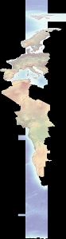
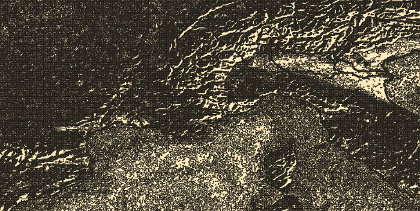

Raster Layers
===============

Get Raster Metadata
----------------------

Get raster metadata for quick-and-dirty resolution checks

.. code-block:: python

    from osgeo import gdal
    gtif = gdal.Open( "INPUT.tif" )
    print gtif.GetMetadata()

Get Raster Band 
-------------------

Get a raster band. Notice how we are handling runtime errors this function might throw.

.. code-block:: python

    from osgeo import gdal
    import sys
    # this allows GDAL to throw Python Exceptions
    gdal.UseExceptions() 

    src_ds = gdal.Open( "INTPUT.tif" )
    if src_ds is None:
        print 'Unable to open %s' % src_filename
        sys.exit(1)

    try:
        srcband = src_ds.GetRasterBand(1)
    except RuntimeError, e:
        # for example, try GetRasterBand(10)
        print 'Band ( %i ) not found' % band_num
        print e
        sys.exit(1)

Get Raster Band Information
-------------------------------

Using the documentation on the `Band API <http://gdal.org/python/osgeo.gdal.Band-class.html>`_ we can 
write a script that dumps out single band information

.. code-block:: python

    from osgeo import gdal
    import sys
    gdal.UseExceptions()

    def Usage():
        print("""
        $ getrasterband.py [ band number ] input-raster
        """)
        sys.exit(1)

    def main( band_num, input_file ):
        src_ds = gdal.Open( input_file )
        if src_ds is None:
            print 'Unable to open %s' % src_filename
            sys.exit(1)

        try:
            srcband = src_ds.GetRasterBand(band_num)
        except RuntimeError, e:
            print 'No band %i found' % band_num
            print e
            sys.exit(1)

        print "[ NO DATA VALUE ] = ", srcband.GetNoDataValue()
        print "[ MIN ] = ", srcband.GetMinimum()
        print "[ MAX ] = ", srcband.GetMaximum()
        print "[ SCALE ] = ", srcband.GetScale()
        print "[ UNIT TYPE ] = ", srcband.GetUnitType()
        ctable = srcband.GetColorTable()
        
        if ctable is None:
            print 'No ColorTable found'
            sys.exit(1)
        
        print "[ COLOR TABLE COUNT ] = ", ctable.GetCount()
        for i in range( 0, ctable.GetCount() ):
            entry = ctable.GetColorEntry( i )
            if not entry:
                continue
            print "[ COLOR ENTRY RGB ] = ", ctable.GetColorEntryAsRGB( i, entry )

    if __name__ == '__main__':

        if len( sys.argv ) < 3:
            print """
            [ ERROR ] you must supply at least two arguments: 
            1) the band number to retrieve and 2) input raster
            """
            Usage()

        main( int(sys.argv[1]), sys.argv[2] )

Polygonize a Raster Band
----------------------------

Turn a single raster band into a vector polygon!

If you haven't before, notice that some of the `gdal utilties <http://www.gdal.org/gdal_utilities.html>`_ 
are actually Python scripts. Go find them on your computer, read the source code and mine them for API tricks.
It turns out the `gdal_polygonize utility <http://www.gdal.org/gdal_polygonize.html>`_ 
just wraps a call to `GDALFPolygonize <http://www.gdal.org/gdal__alg_8h.html#a3f522a9035d3512b5d414fb4752671b1>`_
so writing your own hacky polygonize Python script is pretty easy.

The raster we are going to polygonize:

.. code-block:: python

    from osgeo import gdal, ogr
    import sys
    # this allows GDAL to throw Python Exceptions
    gdal.UseExceptions() 

    #
    #  get raster datasource
    #
    src_ds = gdal.Open( "INPUT.tif" )
    if src_ds is None:
        print 'Unable to open %s' % src_filename
        sys.exit(1)

    try:
        srcband = src_ds.GetRasterBand(3)
    except RuntimeError, e:
        # for example, try GetRasterBand(10)
        print 'Band ( %i ) not found' % band_num
        print e
        sys.exit(1)

    #
    #  create output datasource
    # 
    dst_layername = "POLYGONIZED_STUFF" 
    drv = ogr.GetDriverByName("ESRI Shapefile")
    dst_ds = drv.CreateDataSource( dst_layername + ".shp" )
    dst_layer = dst_ds.CreateLayer(dst_layername, srs = None )

    gdal.Polygonize( srcband, None, dst_layer, -1, [], callback=None )

A closeup of the vector output -- this is northern Italy:

Convert an OGR File to a Raster
---------------------------------

This recipe takes in a OGR file (e.g. shapefile) and creates a new raster Tiff file based on the shapefile.

.. code-block:: python

    from osgeo import gdal, ogr

    # Define pixel_size and NoData value of new raster
    pixel_size = 25
    NoData_value = -9999
    
    # Filename of input OGR file
    vector_fn = 'test.shp'
    
    # Filename of the raster Tiff that will be created
    raster_fn = 'test.tif'

    # Open the data source and read in the extent
    source_ds = ogr.Open(vector_fn)
    source_layer = source_ds.GetLayer()
    source_srs = source_layer.GetSpatialRef()
    x_min, x_max, y_min, y_max = source_layer.GetExtent()

    # Create the destination data source
    x_res = int((x_max - x_min) / pixel_size)
    y_res = int((y_max - y_min) / pixel_size)
    target_ds = gdal.GetDriverByName('GTiff').Create(raster_fn, x_res, y_res, gdal.GDT_Byte)
    target_ds.SetGeoTransform((x_min, pixel_size, 0, y_max, 0, -pixel_size))
    band = target_ds.GetRasterBand(1)
    band.SetNoDataValue(NoData_value)

    # Rasterize
    gdal.RasterizeLayer(target_ds, [1], source_layer, burn_values=[0])

Clip a GeoTiff with Shapefile
---------------------------------

Let's use some `Natural Earth data <http://www.naturalearthdata.com/downloads>`_ and clip a `10m relief geotiff <http://www.naturalearthdata.com/downloads/10m-cross-blend-hypso/cross-blended-hypso-with-relief-water-drains-and-ocean-bottom/>`_ with the `Europe/Paris timezone polygon <http://www.naturalearthdata.com/downloads/10m-cultural-vectors/timezones/>`_. Most of the following workflow came from this `geospatialpython post <http://geospatialpython.com/2011/02/clip-raster-using-shapefile.html>`_ . However, the source code on that site assumes your clipping polygon **is** the same extent as the input geotiff. If it is not, then your clipped geotiff will take the input geotiff's extent, which will be incorrect. The modified script below takes this into account and sets the correct x,y offsets for the clipped geotiff. Note, in the following example we are assuming you have the `Python Imaging Library <http://www.pythonware.com/products/pil/>`_ installed.

Before Image: the input Natural Earth 10m geotiff with the timezone overlay we want to clip out:

.. image:: images/clip_raster_before.png

.. code-block:: bash

    from osgeo import gdal, gdalnumeric, ogr, osr
    import Image, ImageDraw
    import os, sys
    gdal.UseExceptions()

    # This function will convert the rasterized clipper shapefile 
    # to a mask for use within GDAL.    
    def imageToArray(i):
        """
        Converts a Python Imaging Library array to a 
        gdalnumeric image.
        """
        a=gdalnumeric.fromstring(i.tostring(),'b')
        a.shape=i.im.size[1], i.im.size[0]
        return a

    def arrayToImage(a):
        """
        Converts a gdalnumeric array to a 
        Python Imaging Library Image.
        """
        i=Image.fromstring('L',(a.shape[1],a.shape[0]),
                (a.astype('b')).tostring())
        return i
         
    def world2Pixel(geoMatrix, x, y):
      """
      Uses a gdal geomatrix (gdal.GetGeoTransform()) to calculate
      the pixel location of a geospatial coordinate 
      """
      ulX = geoMatrix[0]
      ulY = geoMatrix[3]
      xDist = geoMatrix[1]
      yDist = geoMatrix[5]
      rtnX = geoMatrix[2]
      rtnY = geoMatrix[4]
      pixel = int((x - ulX) / xDist)
      line = int((ulY - y) / xDist)
      return (pixel, line) 

    #
    #  EDIT: this is basically an overloaded
    #  version of the gdal_array.OpenArray passing in xoff, yoff explicitly
    #  so we can pass these params off to CopyDatasetInfo
    #
    def OpenArray( array, prototype_ds = None, xoff=0, yoff=0 ): 
        ds = gdal.Open( gdalnumeric.GetArrayFilename(array) ) 

        if ds is not None and prototype_ds is not None: 
            if type(prototype_ds).__name__ == 'str': 
                prototype_ds = gdal.Open( prototype_ds ) 
            if prototype_ds is not None: 
                gdalnumeric.CopyDatasetInfo( prototype_ds, ds, xoff=xoff, yoff=yoff ) 
        return ds 

    def histogram(a, bins=range(0,256)):
      """
      Histogram function for multi-dimensional array.
      a = array
      bins = range of numbers to match 
      """
      fa = a.flat
      n = gdalnumeric.searchsorted(gdalnumeric.sort(fa), bins)
      n = gdalnumeric.concatenate([n, [len(fa)]])
      hist = n[1:]-n[:-1] 
      return hist

    def stretch(a):
      """
      Performs a histogram stretch on a gdalnumeric array image.
      """
      hist = histogram(a)
      im = arrayToImage(a)   
      lut = []
      for b in range(0, len(hist), 256):
        # step size
        step = reduce(operator.add, hist[b:b+256]) / 255
        # create equalization lookup table
        n = 0
        for i in range(256):
          lut.append(n / step)
          n = n + hist[i+b]
      im = im.point(lut)
      return imageToArray(im)

    def main( shapefile_path, raster_path ):
        # Load the source data as a gdalnumeric array
        srcArray = gdalnumeric.LoadFile(raster_path)

        # Also load as a gdal image to get geotransform 
        # (world file) info
        srcImage = gdal.Open(raster_path)
        geoTrans = srcImage.GetGeoTransform()

        # Create an OGR layer from a boundary shapefile
        shapef = ogr.Open(shapefile_path)
        lyr = shapef.GetLayer( os.path.split( os.path.splitext( shapefile_path )[0] )[1] )
        poly = lyr.GetNextFeature()

        # Convert the layer extent to image pixel coordinates
        minX, maxX, minY, maxY = lyr.GetExtent()
        ulX, ulY = world2Pixel(geoTrans, minX, maxY)
        lrX, lrY = world2Pixel(geoTrans, maxX, minY)

        # Calculate the pixel size of the new image
        pxWidth = int(lrX - ulX)
        pxHeight = int(lrY - ulY)

        clip = srcArray[:, ulY:lrY, ulX:lrX]

        #
        # EDIT: create pixel offset to pass to new image Projection info
        #
        xoffset =  ulX 
        yoffset =  ulY
        print "Xoffset, Yoffset = ( %f, %f )" % ( xoffset, yoffset )

        # Create a new geomatrix for the image
        geoTrans = list(geoTrans)
        geoTrans[0] = minX
        geoTrans[3] = maxY

        # Map points to pixels for drawing the 
        # boundary on a blank 8-bit, 
        # black and white, mask image.
        points = []
        pixels = []
        geom = poly.GetGeometryRef()
        pts = geom.GetGeometryRef(0)
        for p in range(pts.GetPointCount()):
          points.append((pts.GetX(p), pts.GetY(p)))
        for p in points:
          pixels.append(world2Pixel(geoTrans, p[0], p[1]))
        rasterPoly = Image.new("L", (pxWidth, pxHeight), 1)
        rasterize = ImageDraw.Draw(rasterPoly)
        rasterize.polygon(pixels, 0)
        mask = imageToArray(rasterPoly)   

        # Clip the image using the mask
        clip = gdalnumeric.choose(mask, \
            (clip, 0)).astype(gdalnumeric.uint8)

        # This image has 3 bands so we stretch each one to make them
        # visually brighter
        for i in range(3):
          clip[i,:,:] = stretch(clip[i,:,:])

        # Save new tiff
        #
        #  EDIT: instead of SaveArray, let's break all the
        #  SaveArray steps out more explicity so 
        #  we can overwrite the offset of the destination
        #  raster
        #
        ### the old way using SaveArray
        #
        # gdalnumeric.SaveArray(clip, "OUTPUT.tif", format="GTiff", prototype=raster_path)
        #
        ###
        #
        gtiffDriver = gdal.GetDriverByName( 'GTiff' ) 
        if gtiffDriver is None: 
            raise ValueError("Can't find GeoTiff Driver") 
        gtiffDriver.CreateCopy( "OUTPUT.tif", 
            OpenArray( clip, prototype_ds=raster_path, xoff=xoffset, yoff=yoffset ) 
        )

        # Save as an 8-bit jpeg for an easy, quick preview
        clip = clip.astype(gdalnumeric.uint8)
        gdalnumeric.SaveArray(clip, "OUTPUT.jpg", format="JPEG")

        gdal.ErrorReset()

    if __name__ == '__main__':

        #
        # example run : $ python clip.py /<full-path>/<shapefile-name>.shp /<full-path>/<raster-name>.tif
        #
        if len( sys.argv ) < 2:
            print "[ ERROR ] you must two args. 1) the full shapefile path and 2) the full raster path"
            sys.exit( 1 )

        main( sys.argv[1], sys.argv[2] )

After Image: the clipped geotiff with the timezone border overlayed in orange on top of input geotiff:

.. image:: images/clip_raster_after.png

