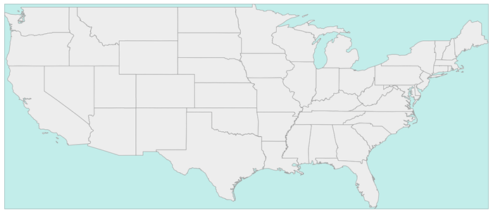
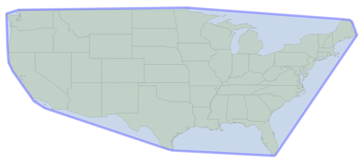
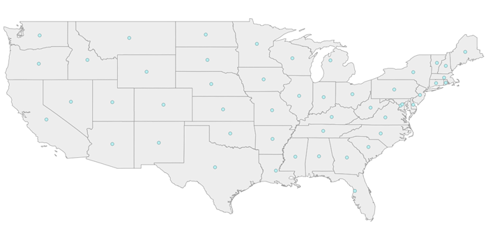
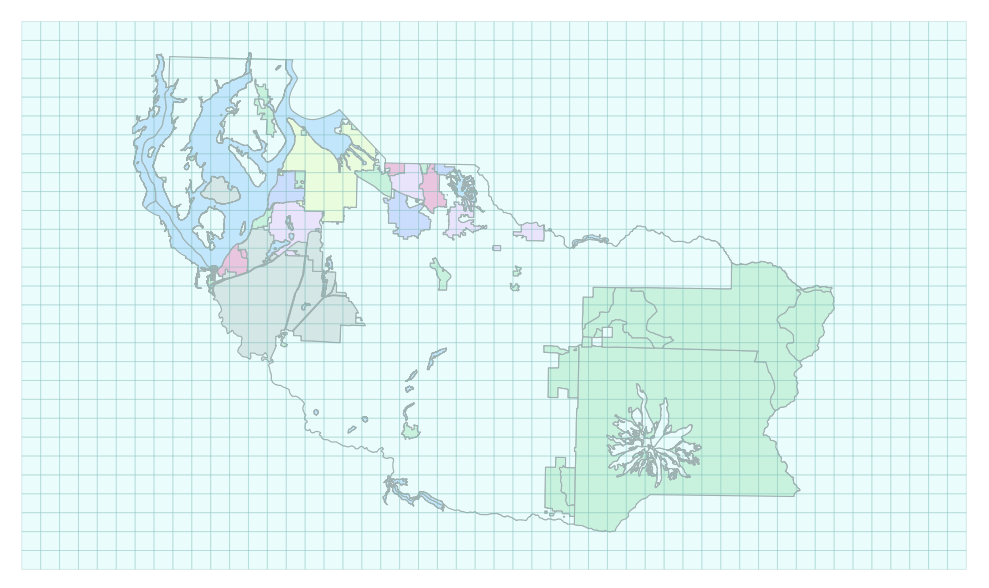
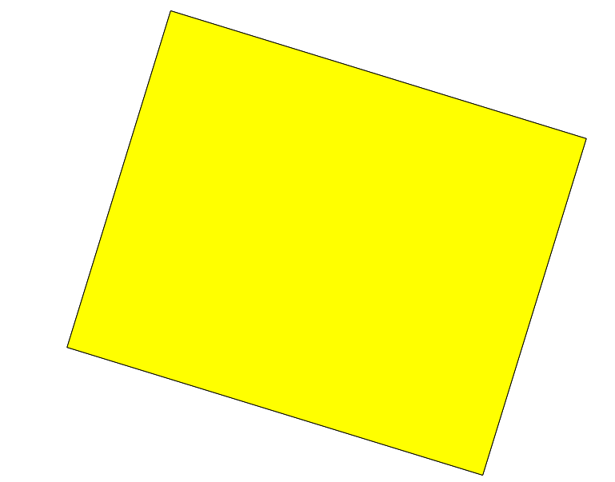
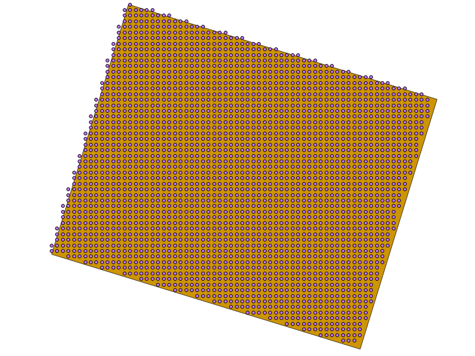

Vector Layers
================

Delete a file
-------------------

.. code-block:: python

    from osgeo import ogr
    import os

    DriverName = "ESRI Shapefile"      # e.g.: GeoJSON, ESRI Shapefile
    FileName = 'test.shp'
    driver = ogr.GetDriverByName(DriverName)
    if os.path.exists(FileName):
         driver.DeleteDataSource(FileName)

Is Ogr Installed
-------------------

.. code-block:: python

    try:
      from osgeo import ogr
      print 'Import of ogr from osgeo worked.  Hurray!\n'
    except:
      print 'Import of ogr from osgeo failed\n\n'

View Auto Generated Ogr Help
------------------------------      
    This code simply prints out the auto-generated help on the imported module.  In this case it's OGR. This might not
    be the best way to scan the API's class methods. For a detailed description of the whole Python GDAL/OGR API, see the useful `API docs <http://gdal.org/python/>`_.

.. code-block:: python
    
    import osgeo.ogr
    print help(osgeo.ogr)

Get List of Ogr Drivers Alphabetically (A- Z)
-----------------------------------------------

    It's always driven me a little nuts that the command line ogr2ogr --formats returns a 'random' list of drivers.  This code returns the list of OGR drivers alphabetically from A - Z.  .  
   
.. code-block:: python

    import ogr
    cnt = ogr.GetDriverCount()
    formatsList = []  # Empty List

    for i in range(cnt):
        driver = ogr.GetDriver(i)
        driverName = driver.GetName()
        if not driverName in formatsList:
            formatsList.append(driverName)

    formatsList.sort() # Sorting the messy list of ogr drivers 

    for i in formatsList:
        print i
     
Is Ogr Driver Available by Driver Name
--------------------------------------------      
    This code shows if a particular OGR driver is available.  The exact names are the ones used on the OGR Vector Formats page in the "Code" column  ([`formats website <http://www.gdal.org/ogr/ogr_formats.html>`_]).  This is the same names returned when you enter ``ogrinfo --formats`` on the command line.  
    
    Code Example Source: [`website <http://www.gdal.org/ogr/ogr_apitut.html>`_]
    
.. code-block:: python
    
    from osgeo import ogr
    
    ## Shapefile available?
    driverName = "ESRI Shapefile"
    drv = ogr.GetDriverByName( driverName )
    if drv is None:
        print "%s driver not available.\n" % driverName
    else:
        print  "%s driver IS available.\n" % driverName
        
    ## PostgreSQL available?
    driverName = "PostgreSQL"
    drv = ogr.GetDriverByName( driverName )
    if drv is None:
        print "%s driver not available.\n" % driverName
    else:
        print  "%s driver IS available.\n" % driverName
        
    ## Is File GeoDatabase available?
    driverName = "FileGDB"
    drv = ogr.GetDriverByName( driverName )
    if drv is None:
        print "%s driver not available.\n" % driverName
    else:
        print  "%s driver IS available.\n" % driverName
        
    ## SDE available?
    driverName = "SDE"
    drv = ogr.GetDriverByName( driverName )
    if drv is None:
        print "%s driver not available.\n" % driverName
    else:
        print  "%s driver IS available.\n" % driverName

Force Ogr Use Named Driver 
--------------------------------------------      
    Use only the specified driver to attempt to read the data file, taking into account special nature of the CSV driver which normally requires a .csv extension.
	    
    Source, Luke Pinner on GIS Stack Exchange: [`website <http://gis.stackexchange.com/questions/141905/force-ogr-to-use-specific-driver-for-input-format>`_]
    
.. code-block:: python
    
	import sys
	from osgeo import ogr

	def main(in_file, in_format, out_file, out_format):
		if in_format == 'CSV' and in_file[-3:].lower() != 'csv':
			in_file = 'CSV:' + in_file
		in_ds = ogr.GetDriverByName(in_format).Open(in_file)
		out_ds  = ogr.GetDriverByName(out_format).CopyDataSource(in_ds, out_file)

	if __name__ == '__main__':
		main(*sys.argv[1:])

Usage:

	python ogr-convert.py [in file] [format driver] [out file/dir] {out format}
	
	python ogr-convert.py x:\incoming\coolstuff.txt CSV d:\shapefiles

        
Get Shapefile Feature Count
-------------------------------
    This code example opens a shapefile and returns the number of features in it.  Solution mined from: [`web site <http://www.gis.usu.edu/~chrisg/python/2009/lectures/ospy_slides1.pdf>`_] 

.. code-block:: python

    import os
    from osgeo import ogr

    daShapefile = r"C:\Temp\Voting_Centers_and_Ballot_Sites.shp"

    driver = ogr.GetDriverByName('ESRI Shapefile')

    dataSource = driver.Open(daShapefile, 0) # 0 means read-only. 1 means writeable.

    # Check to see if shapefile is found.
    if dataSource is None:
        print 'Could not open %s' % (daShapefile)
    else:
        print 'Opened %s' % (daShapefile)
        layer = dataSource.GetLayer()
        featureCount = layer.GetFeatureCount()  
        print "Number of features in %s: %d" % (os.path.basename(daShapefile),featureCount)

        
    
Get All PostGIS layers in a PostgreSQL Database
--------------------------------------------------

    This returns all the layers in a database of your choosing sorted in alphabetical order (of course).  Just fill in the missing information and it should work.  
    
.. code-block:: python

    from osgeo import ogr

    databaseServer = "<IP of database server OR Name of database server"
    databaseName = "<Name of database>"
    databaseUser = "<User name>"
    databasePW = "<User password>"

    connString = "PG: host=%s dbname=%s user=%s password=%s" %(databaseServer,databaseName,databaseUser,databasePW)

    conn = ogr.Open(connString)

    layerList = []
    for i in conn:
        daLayer = i.GetName()
        if not daLayer in layerList:
            layerList.append(daLayer)

    layerList.sort()

    for j in layerList:
        print j
        
    conn.Destroy()

Get PostGIS Layer Feature Count By Layer Name
------------------------------------------------
    This code example opens a postgis connection and gets the specified layer name if it exists in the database. Otherwise it throws a nice error message

.. code-block:: python

    from osgeo import ogr
    import sys

    databaseServer = "<IP of database server OR Name of database server"
    databaseName = "<Name of database>"
    databaseUser = "<User name>"
    databasePW = "<User password>"
    connString = "PG: host=%s dbname=%s user=%s password=%s" % (databaseServer,databaseName,databaseUser,databasePW)

    def GetPGLayer( lyr_name ):
        conn = ogr.Open(connString)

        lyr = conn.GetLayer( lyr_name )
        if lyr is None:
            print >> sys.stderr, '[ ERROR ]: layer name = "%s" could not be found in database "%s"' % ( lyr_name, databaseName )
            sys.exit( 1 )

        featureCount = lyr.GetFeatureCount()
        print "Number of features in %s: %d" % ( lyr_name , featureCount )

        conn.Destroy()

    if __name__ == '__main__':
        
        if len( sys.argv ) < 2:
            print >> sys.stderr, '[ ERROR ]: you must pass at least one argument -- the layer name argument'
            sys.exit( 1 )
        
        lyr_name = sys.argv[1]
        GetPGLayer( lyr_name )

Get all layers in an Esri File GeoDataBase
--------------------------------------------------

    This returns all the layers in a Esri FileGDB in alphabetical order (of course). It needs GDAL/OGR 1.11.0 + but not any Esri dependency.
    That's the benefit of the `OpenFileGDB driver developed by Ewen Rouault <http://www.gdal.org/drv_openfilegdb.html>`_ relative to the `FileGDB driver <http://www.gdal.org/drv_filegdb.html>`_.
    
.. code-block:: python

    # standard imports
    import sys

    # import OGR
    from osgeo import ogr

    # use OGR specific exceptions
    ogr.UseExceptions()

    # get the driver
    driver = ogr.GetDriverByName("OpenFileGDB")

    # opening the FileGDB
    try:
        gdb = driver.Open(gdb_path, 0)
    except Exception, e:
        print e
        sys.exit()

    # list to store layers'names
    featsClassList = []

    # parsing layers by index
    for featsClass_idx in range(gdb.GetLayerCount()):
        featsClass = gdb.GetLayerByIndex(featsClass_idx)
        featsClassList.append(featsClass.GetName())

    # sorting
    featsClassList.sort()

    # printing
    for featsClass in featsClassList:
        print featsClass
        
    # clean close
    del gdb
        
Iterate over Features
------------------------
 
.. code-block:: python

    from osgeo import ogr
    import os

    shapefile = "states.shp"
    driver = ogr.GetDriverByName("ESRI Shapefile")
    dataSource = driver.Open(shapefile, 0)
    layer = dataSource.GetLayer()

    for feature in layer:
        print feature.GetField("STATE_NAME")

Get Geometry from each Feature in a Layer
--------------------------------------------

.. code-block:: python

    from osgeo import ogr
    import os

    shapefile = "states.shp"
    driver = ogr.GetDriverByName("ESRI Shapefile")
    dataSource = driver.Open(shapefile, 0)
    layer = dataSource.GetLayer()

    for feature in layer:
        geom = feature.GetGeometryRef()
        print geom.Centroid().ExportToWkt()

Filter by attribute
----------------------
 
.. code-block:: python  
     
    from osgeo import ogr
    import os

    shapefile = "states.shp"
    driver = ogr.GetDriverByName("ESRI Shapefile")
    dataSource = driver.Open(shapefile, 0)
    layer = dataSource.GetLayer()

    layer.SetAttributeFilter("SUB_REGION = 'Pacific'")

    for feature in layer:
        print feature.GetField("STATE_NAME")

Spatial Filter
-----------------

.. code-block:: python  

    from osgeo import ogr
    import os

    shapefile = "states.shp"
    driver = ogr.GetDriverByName("ESRI Shapefile")
    dataSource = driver.Open(shapefile, 0)
    layer = dataSource.GetLayer()

    wkt = "POLYGON ((-103.81402655265633 50.253951270672125,-102.94583419409656 51.535568561879401,-100.34125711841725 51.328856095555651,-100.34125711841725 51.328856095555651,-93.437060743203844 50.460663736995883,-93.767800689321859 46.450441890315041,-94.635993047881612 41.613370178339181,-100.75468205106476 41.365315218750681,-106.12920617548238 42.564247523428456,-105.96383620242338 47.277291755610058,-103.81402655265633 50.253951270672125))"
    layer.SetSpatialFilter(ogr.CreateGeometryFromWkt(wkt))

    for feature in layer:
        print feature.GetField("STATE_NAME")

Get Shapefile Fields - Get the user defined fields
------------------------------------------------------
 
    This code example returns the field names of the user defined (created) fields.  

.. code-block:: python
    
    from osgeo import ogr
    
    daShapefile = r"C:\Temp\Voting_Centers_and_Ballot_Sites.shp"

    dataSource = ogr.Open(daShapefile)
    daLayer = dataSource.GetLayer(0)
    layerDefinition = daLayer.GetLayerDefn()

    for i in range(layerDefinition.GetFieldCount()):
        print layerDefinition.GetFieldDefn(i).GetName() 

        
        
Get Shapefile Fields and Types - Get the user defined fields
----------------------------------------------------------------

     This code example returns the field names of the user defined (created) fields and the data types they are.
     
.. code-block:: python    

    from osgeo import ogr

    daShapefile = r"C:\Temp\iDay\CWI_Wetlands.shp"

    dataSource = ogr.Open(daShapefile)
    daLayer = dataSource.GetLayer(0)
    layerDefinition = daLayer.GetLayerDefn()

    print "Name  -  Type  Width  Precision"
    for i in range(layerDefinition.GetFieldCount()):
        fieldName =  layerDefinition.GetFieldDefn(i).GetName()
        fieldTypeCode = layerDefinition.GetFieldDefn(i).GetType()
        fieldType = layerDefinition.GetFieldDefn(i).GetFieldTypeName(fieldTypeCode)
        fieldWidth = layerDefinition.GetFieldDefn(i).GetWidth()
        GetPrecision = layerDefinition.GetFieldDefn(i).GetPrecision()

        print fieldName + " - " + fieldType+ " " + str(fieldWidth) + " " + str(GetPrecision)  
 

Get PostGIS Layer Fields - Get the user defined fields
---------------------------------------------------------
 
    This code example returns the field names of the user defined (created) fields.  

.. code-block:: python

    from osgeo import ogr
    import sys

    databaseServer = "<IP of database server OR Name of database server"
    databaseName = "<Name of database>"
    databaseUser = "<User name>"
    databasePW = "<User password>"
    connString = "PG: host=%s dbname=%s user=%s password=%s" %(databaseServer,databaseName,databaseUser,databasePW)

    def GetPGLayerFields( lyr_name ):
        conn = ogr.Open(connString)

        lyr = conn.GetLayer( lyr_name )
        if lyr is None:
            print >> sys.stderr, '[ ERROR ]: layer name = "%s" could not be found in database "%s"' % ( lyr_name, databaseName )
            sys.exit( 1 )

        lyrDefn = lyr.GetLayerDefn()

        for i in range( lyrDefn.GetFieldCount() ):
            print lyrDefn.GetFieldDefn( i ).GetName()

        conn.Destroy()

    if __name__ == '__main__':
        
        if len( sys.argv ) < 2:
            print >> sys.stderr, '[ ERROR ]: you must pass at least one argument -- the layer name argument'
            sys.exit( 1 )
        
        lyr_name = sys.argv[1]
        GetPGLayerFields( lyr_name )

Get PostGIS Layer Fields and Types - Get the user defined fields
---------------------------------------------------------------------

     This code example returns the field names of the user defined (created) fields and the data types they are.
     
.. code-block:: python    

    from osgeo import ogr
    import sys

    databaseServer = "<IP of database server OR Name of database server"
    databaseName = "<Name of database>"
    databaseUser = "<User name>"
    databasePW = "<User password>"
    connString = "PG: host=%s dbname=%s user=%s password=%s" %(databaseServer,databaseName,databaseUser,databasePW)

    def GetPGLayerFieldTypes( lyr_name ):
        conn = ogr.Open(connString)

        lyr = conn.GetLayer( lyr_name )
        if lyr is None:
            print >> sys.stderr, '[ ERROR ]: layer name = "%s" could not be found in database "%s"' % ( lyr_name, databaseName )
            sys.exit( 1 )

        lyrDefn = lyr.GetLayerDefn()
        for i in range( lyrDefn.GetFieldCount() ):
            fieldName =  lyrDefn.GetFieldDefn(i).GetName()
            fieldTypeCode = lyrDefn.GetFieldDefn(i).GetType()
            fieldType = lyrDefn.GetFieldDefn(i).GetFieldTypeName(fieldTypeCode)
            fieldWidth = lyrDefn.GetFieldDefn(i).GetWidth()
            GetPrecision = lyrDefn.GetFieldDefn(i).GetPrecision()

            print fieldName + " - " + fieldType+ " " + str(fieldWidth) + " " + str(GetPrecision)

        conn.Destroy()

    if __name__ == '__main__':
        
        if len( sys.argv ) < 2:
            print >> sys.stderr, '[ ERROR ]: you must pass at least one argument -- the layer name argument'
            sys.exit( 1 )
        
        lyr_name = sys.argv[1]
        GetPGLayerFieldTypes( lyr_name )

Get a Layer's Capabilities
--------------------------

.. code-block:: python

    from osgeo import ogr

    ds = ogr.Open("states.shp",0)
    layer = ds.GetLayer()
    capabilities = [
        ogr.OLCRandomRead,
        ogr.OLCSequentialWrite,
        ogr.OLCRandomWrite, 
        ogr.OLCFastSpatialFilter,
        ogr.OLCFastFeatureCount, 
        ogr.OLCFastGetExtent, 
        ogr.OLCCreateField, 
        ogr.OLCDeleteField, 
        ogr.OLCReorderFields, 
        ogr.OLCAlterFieldDefn, 
        ogr.OLCTransactions, 
        ogr.OLCDeleteFeature, 
        ogr.OLCFastSetNextByIndex, 
        ogr.OLCStringsAsUTF8, 
        ogr.OLCIgnoreFields 
    ]

    print("Layer Capabilities:")
    for cap in capabilities:
        print("  %s = %s" % (cap, layer.TestCapability(cap)))

Get WFS layers and iterate over features
-----------------------------------------
This recipe queries a WFS services and fetches features from a large layer. It sets up the GDAL 
configuration to using WFS paging if it is supported.

.. code-block:: python

    import sys
    
    try:
        from osgeo import ogr, osr, gdal
    except:
        sys.exit('ERROR: cannot find GDAL/OGR modules')

    # Set the driver (optional)
    wfs_drv = ogr.GetDriverByName('WFS')

    # Speeds up querying WFS capabilities for services with alot of layers
    gdal.SetConfigOption('OGR_WFS_LOAD_MULTIPLE_LAYER_DEFN', 'NO')

    # Set config for paging. Works on WFS 2.0 services and WFS 1.0 and 1.1 with some other services.
    gdal.SetConfigOption('OGR_WFS_PAGING_ALLOWED', 'YES')
    gdal.SetConfigOption('OGR_WFS_PAGE_SIZE', '10000')

    # Open the webservice
    url = 'http://example-service.com/wfs'
    wfs_ds = wfs_drv.Open('WFS:' + url)
    if not wfs_ds:
        sys.exit('ERROR: can not open WFS datasource')
    else:
        pass

    # iterate over available layers
    for i in range(wfs.GetLayerCount()):
        layer = wfs.GetLayerByIndex(i)
        srs = layer.GetSpatialRef()
        print 'Layer: %s, Features: %s, SR: %s...' % (layer.GetName(), layer.GetFeatureCount(), sr.ExportToWkt()[0:50])

        # iterate over features
        feat = layer.GetNextFeature()
        while feat is not None:
            feat = layer.GetNextFeature()
            # do something more..
        feat = None

    # Get a specific layer
    layer = wfs_ds.GetLayerByName("largelayer")
    if not layer:
        sys.exit('ERROR: can not find layer in service')
    else:
        pass
  
Set HTTP Proxy options before fetching a web datasource
---------------------------------------------------------
This recipe sets options for a HTTP proxy service that using NTLM authentication (typical 
for corporate environments that using Active directory for single sign-on proxy support). 
More information about the GDAL HTTP proxy options can be found `here <http://trac.osgeo.org/gdal/wiki/ConfigOptions#GDALOGRHTTPoptions>`_  
  
.. code-block:: python

    import sys
    
    try:
        from osgeo import ogr, osr, gdal
    except:
        sys.exit('ERROR: cannot find GDAL/OGR modules')
    
    server = 'proxy.example.com'
    port = 3128

    # specify proxy server
    gdal.SetConfigOption('GDAL_HTTP_PROXY', server + ':' + port)
    
    # setup proxy authentication option for NTLM with no username or password so single sign-on works
    gdal.SetConfigOption('GDAL_PROXY_AUTH', 'NTLM')
    gdal.SetConfigOption('GDAL_HTTP_PROXYUSERPWD', ' : ')
    
    # now fetch a HTTP datasource and do something...
    ds = ogr.Open('http://featureserver/cities/.geojson')
    if not ds:
        sys.exit('ERROR: can not open GeoJSON datasource')
    lyr = ds.GetLayer('OGRGeoJSON')
    for feat in lyr:
        geom = feat.GetGeometryRef()
        print geom.ExportToWkt()

Read a CSV of Coordinates as an OGRVRTLayer
------------------------------------------------

GDAL/OGR has a `Virtual Format spec <http://www.gdal.org/ogr/drv_vrt.html>`_ that allows you to derive layers from flat tables such as a CSV -- it does a lot more than that too so go read about it. In the example below we are reading in a CSV with X,Y columns and values. That CSV file is wrapped by an XML file that describes it as an OGR layer. Below are all the necessary pieces and a script that reads the XML file and prints out point geometries.

Our CSV file named `example.csv` looks like this:

.. code-block:: bash

    ID,X,Y
    1,-127.234343,47.234325
    2,-127.003243,46.234343
    3,-127.345646,45.234324
    4,-126.234324,44.324234

Our OGRVRTLayer XML file called `example_wrapper.vrt` looks like this:

.. code-block:: bash

    <OGRVRTDataSource>
        <OGRVRTLayer name="example">
            <SrcDataSource>example.csv</SrcDataSource> 
            <SrcLayer>example</SrcLayer> 
            <GeometryType>wkbPoint</GeometryType> 
                <LayerSRS>WGS84</LayerSRS>
            <GeometryField encoding="PointFromColumns" x="X" y="Y"/> 
        </OGRVRTLayer>
    </OGRVRTDataSource>

Now let's print out the point geometries:

.. code-block:: python

    from osgeo import ogr
    ogr.UseExceptions()

    inDataSource = ogr.Open("example_wrapper.vrt")
    lyr = inDataSource.GetLayer('example')
    for feat in lyr:
        geom = feat.GetGeometryRef()
        print geom.ExportToWkt()

Create a new Layer from the extent of an existing Layer
----------------------------------------------------------   

.. code-block:: python

    from osgeo import ogr
    import os

    # Get a Layer's Extent
    inShapefile = "states.shp"
    inDriver = ogr.GetDriverByName("ESRI Shapefile")
    inDataSource = inDriver.Open(inShapefile, 0)
    inLayer = inDataSource.GetLayer()
    extent = inLayer.GetExtent()

    # Create a Polygon from the extent tuple
    ring = ogr.Geometry(ogr.wkbLinearRing)
    ring.AddPoint(extent[0],extent[2]) 
    ring.AddPoint(extent[1], extent[2])
    ring.AddPoint(extent[1], extent[3])
    ring.AddPoint(extent[0], extent[3]) 
    ring.AddPoint(extent[0],extent[2]) 
    poly = ogr.Geometry(ogr.wkbPolygon)
    poly.AddGeometry(ring)

    # Save extent to a new Shapefile
    outShapefile = "states_extent.shp"
    outDriver = ogr.GetDriverByName("ESRI Shapefile")

    # Remove output shapefile if it already exists
    if os.path.exists(outShapefile):
        outDriver.DeleteDataSource(outShapefile)

    # Create the output shapefile
    outDataSource = outDriver.CreateDataSource(outShapefile)
    outLayer = outDataSource.CreateLayer("states_extent", geom_type=ogr.wkbPolygon)

    # Add an ID field
    idField = ogr.FieldDefn("id", ogr.OFTInteger)
    outLayer.CreateField(idField)

    # Create the feature and set values
    featureDefn = outLayer.GetLayerDefn()
    feature = ogr.Feature(featureDefn)
    feature.SetGeometry(poly)
    feature.SetField("id", 1)
    outLayer.CreateFeature(feature)

    # Close DataSource
    inDataSource.Destroy()
    outDataSource.Destroy()
    
Save the convex hull of all geometry from an input Layer to an output Layer
---------------------------------------------------------------------------

.. code-block:: python

    from osgeo import ogr
    import os

    # Get a Layer
    inShapefile = "states.shp"
    inDriver = ogr.GetDriverByName("ESRI Shapefile")
    inDataSource = inDriver.Open(inShapefile, 0)
    inLayer = inDataSource.GetLayer()

    # Collect all Geometry
    geomcol = ogr.Geometry(ogr.wkbGeometryCollection)
    for feature in inLayer:
        geomcol.AddGeometry(feature.GetGeometryRef())

    # Calculate convex hull
    convexhull = geomcol.ConvexHull()

    # Save extent to a new Shapefile
    outShapefile = "states_convexhull.shp"
    outDriver = ogr.GetDriverByName("ESRI Shapefile")

    # Remove output shapefile if it already exists
    if os.path.exists(outShapefile):
        outDriver.DeleteDataSource(outShapefile)

    # Create the output shapefile
    outDataSource = outDriver.CreateDataSource(outShapefile)
    outLayer = outDataSource.CreateLayer("states_convexhull", geom_type=ogr.wkbPolygon)

    # Add an ID field
    idField = ogr.FieldDefn("id", ogr.OFTInteger)
    outLayer.CreateField(idField)

    # Create the feature and set values
    featureDefn = outLayer.GetLayerDefn()
    feature = ogr.Feature(featureDefn)
    feature.SetGeometry(convexhull)
    feature.SetField("id", 1)
    outLayer.CreateFeature(feature)

    # Close DataSource
    inDataSource.Destroy()
    outDataSource.Destroy()

Save centroids of input Layer to an output Layer
-----------------------------------------------------

Inspired by: http://www.kralidis.ca/blog/2010/04/28/batch-centroid-calculations-with-python-and-ogr/

.. code-block:: python

    from osgeo import ogr
    import os

    # Get the input Layer
    inShapefile = "states.shp"
    inDriver = ogr.GetDriverByName("ESRI Shapefile")
    inDataSource = inDriver.Open(inShapefile, 0)
    inLayer = inDataSource.GetLayer()

    # Create the output Layer
    outShapefile = "states_centroids.shp"
    outDriver = ogr.GetDriverByName("ESRI Shapefile")

    # Remove output shapefile if it already exists
    if os.path.exists(outShapefile):
        outDriver.DeleteDataSource(outShapefile)

    # Create the output shapefile
    outDataSource = outDriver.CreateDataSource(outShapefile)
    outLayer = outDataSource.CreateLayer("states_centroids", geom_type=ogr.wkbPoint)

    # Add input Layer Fields to the output Layer
    inLayerDefn = inLayer.GetLayerDefn()
    for i in range(0, inLayerDefn.GetFieldCount()):
        fieldDefn = inLayerDefn.GetFieldDefn(i)
        outLayer.CreateField(fieldDefn)

    # Get the output Layer's Feature Definition
    outLayerDefn = outLayer.GetLayerDefn()

    # Add features to the ouput Layer
    for i in range(0, inLayer.GetFeatureCount()):
        # Get the input Feature
        inFeature = inLayer.GetFeature(i)
        # Create output Feature
        outFeature = ogr.Feature(outLayerDefn)
        # Add field values from input Layer
        for i in range(0, outLayerDefn.GetFieldCount()):
            outFeature.SetField(outLayerDefn.GetFieldDefn(i).GetNameRef(), inFeature.GetField(i))
        # Set geometry as centroid    
        geom = inFeature.GetGeometryRef()
        centroid = geom.Centroid()
        outFeature.SetGeometry(centroid)
        # Add new feature to output Layer
        outLayer.CreateFeature(outFeature)

    # Close DataSources
    inDataSource.Destroy()
    outDataSource.Destroy()
    
Create a New Shapefile and Add Data
---------------------------------------

This recipe parses a delimited text file of volcano location data and creates a shapefile.
The CSV file ``volcano_data.txt`` contains the following fields, separated by a tab character (\\t):

*  Name
*  Region
*  Latitude
*  Longitude
*  Elevation

`Taken from The Geospatial Desktop book.`

.. code-block:: python

  # Parse a delimited text file of volcano data and create a shapefile 

  import osgeo.ogr as ogr 
  import osgeo.osr as osr

  # use a dictionary reader so we can access by field name
  reader = csv.DictReader(open("volcano_data.txt","rb"), 
      delimiter='\t',     
      quoting=csv.QUOTE_NONE)

  # set up the shapefile driver
  driver = ogr.GetDriverByName("ESRI Shapefile") 

  # create the data source
  data_source = driver.CreateDataSource("volcanoes.shp") 

  # create the spatial reference, WGS84
  srs = osr.SpatialReference() 
  srs.ImportFromEPSG(4326)

  # create the layer
  layer = data_source.CreateLayer("volcanoes", srs, ogr.wkbPoint) 

  # Add the fields we're interested in
  field_name = ogr.FieldDefn("Name", ogr.OFTString) 
  field_name.SetWidth(24) 
  layer.CreateField(field_name) 
  field_region = ogr.FieldDefn("Region", ogr.OFTString)
  field_region.SetWidth(24)
  layer.CreateField(field_region)
  layer.CreateField(ogr.FieldDefn("Latitude", ogr.OFTReal)) 
  layer.CreateField(ogr.FieldDefn("Longitude", ogr.OFTReal))
  layer.CreateField(ogr.FieldDefn("Elevation", ogr.OFTInteger)) 

  # Process the text file and add the attributes and features to the shapefile
  for row in reader: 
    # create the feature
    feature = ogr.Feature(layer.GetLayerDefn()) 
    # Set the attributes using the values from the delimited text file
    feature.SetField("Name", row['Name']) 
    feature.SetField("Region", row['Region'])
    feature.SetField("Latitude", row['Latitude'])
    feature.SetField("Longitude", row['Longitude'])
    feature.SetField("Elevation", row['Elev']) 

    # create the WKT for the feature using Python string formatting
    wkt = "POINT(%f %f)" %  (float(row['Longitude']) , float(row['Latitude'])) 

    # Create the point from the Well Known Txt
    point = ogr.CreateGeometryFromWkt(wkt)  

    # Set the feature geometry using the point
    feature.SetGeometry(point) 
    # Create the feature in the layer (shapefile)
    layer.CreateFeature(feature) 
    # Destroy the feature to free resources
    feature.Destroy() 

  # Destroy the data source to free resources
  data_source.Destroy() 
   
   
Create a PostGIS table from WKT
-----------------------------------------------------------------------------
This recipe creates a new table in an existing PostGIS database.

.. code-block:: python

    import ogr, osr

    database = 'test'
    usr = 'postgres'
    pw = ''
    table = 'test'

    wkt = "POINT (1120351.5712494177 741921.4223245403)"
    point = ogr.CreateGeometryFromWkt(wkt)

    connectionString = "PG:dbname='%s' user='%s' password='%s'" % (database,usr,pw) 
    ogrds = ogr.Open(connectionString) 

    srs = osr.SpatialReference()
    srs.ImportFromEPSG(4326)

    layer = ogrds.CreateLayer(table, srs, ogr.wkbPoint, ['OVERWRITE=YES'] )

    layerDefn = layer.GetLayerDefn()

    feature = ogr.Feature(layerDefn)
    feature.SetGeometry(point)

    layer.StartTransaction()
    layer.CreateFeature(feature)
    layer.CommitTransaction() 
       

Filter and Select Input Shapefile to New Output Shapefile Like ogr2ogr CLI 
-----------------------------------------------------------------------------
The `ogr2ogr command line tool <http://www.gdal.org/ogr2ogr.html>`_ is an easy way to filter, reproject and trim columns in a shapefile. The workflow below shows how we can approximate the following ogr2ogr command with the OGR api using a decently large `parcel shapefile from King County GIS <http://www5.kingcounty.gov/sdc/Metadata.aspx?Layer=parcel_address>`_ .

.. code-block:: bash

    #
    # this command says read in "parcel_address.shp" and write out to "junkmob.shp" 
    # where "MINOR" column = 'HYDR' value and only output the "PIN" column
    #
    $ ogr2ogr -f "ESRI Shapefile" junkmob.shp -select pin -where "minor = 'HYDR'" parcel_address.shp

.. code-block:: python

    from osgeo import ogr 
    import os, sys

    def main( field_name_target ):
        # Get the input Layer
        inShapefile = "~/DATA/SHAPES/KC_ADMIN/parcel_address/parcel_address.shp"
        inDriver = ogr.GetDriverByName("ESRI Shapefile")
        inDataSource = inDriver.Open(inShapefile, 0)
        inLayer = inDataSource.GetLayer()
        inLayer.SetAttributeFilter("minor = 'HYDR'")

        # Create the output LayerS
        outShapefile = os.path.join( os.path.split( inShapefile )[0], "ogr_api_filter.shp" )
        outDriver = ogr.GetDriverByName("ESRI Shapefile")

        # Remove output shapefile if it already exists
        if os.path.exists(outShapefile):
            outDriver.DeleteDataSource(outShapefile)

        # Create the output shapefile
        outDataSource = outDriver.CreateDataSource(outShapefile)
        out_lyr_name = os.path.splitext( os.path.split( outShapefile )[1] )[0]
        outLayer = outDataSource.CreateLayer( out_lyr_name, geom_type=ogr.wkbMultiPolygon )

        # Add input Layer Fields to the output Layer if it is the one we want
        inLayerDefn = inLayer.GetLayerDefn()
        for i in range(0, inLayerDefn.GetFieldCount()):
            fieldDefn = inLayerDefn.GetFieldDefn(i)
            fieldName = fieldDefn.GetName()
            if fieldName not in field_name_target:
                continue
            outLayer.CreateField(fieldDefn)

        # Get the output Layer's Feature Definition
        outLayerDefn = outLayer.GetLayerDefn()

        # Add features to the ouput Layer
        for inFeature in inLayer:
            # Create output Feature
            outFeature = ogr.Feature(outLayerDefn)
            
            # Add field values from input Layer
            for i in range(0, outLayerDefn.GetFieldCount()):
                fieldDefn = outLayerDefn.GetFieldDefn(i)
                fieldName = fieldDefn.GetName()
                if fieldName not in field_name_target:
                    continue

                outFeature.SetField(outLayerDefn.GetFieldDefn(i).GetNameRef(), 
                    inFeature.GetField(i))
                    
            # Set geometry as centroid
            geom = inFeature.GetGeometryRef()
            outFeature.SetGeometry(geom.Clone())
            # Add new feature to output Layer
            outLayer.CreateFeature(outFeature)

        # Close DataSources
        inDataSource.Destroy()
        outDataSource.Destroy()

    if __name__ == '__main__':
        
        if len( sys.argv ) < 2:
            print "[ ERROR ]: you need to pass at least one arg -- the field_names to include in output"
            sys.exit(1)
        
        main( sys.argv[1:] )
        
Merge OGR Layers
-------------------
This recipe merges OGR Layers within a directory. Files can be specfied based on with what they start and end.

.. code-block:: python      
        

    import os, ogr, osr

    outputMergefn = 'merge.shp'
    directory = "/Users/UserName/Downloads/"
    fileStartsWith = 'test'
    fileEndsWith = '.shp'
    driverName = 'ESRI Shapefile'
    geometryType = ogr.wkbPolygon

    out_driver = ogr.GetDriverByName( driverName )
    if os.path.exists(outputMergefn):
        out_driver.DeleteDataSource(outputMergefn)
    out_ds = out_driver.CreateDataSource(outputMergefn)
    out_layer = out_ds.CreateLayer(outputMergefn, geom_type=geometryType) 

    fileList = os.listdir(directory) 

    for file in fileList:
        if file.startswith(fileStartsWith) and file.endswith(fileEndsWith):
            print file
            ds = ogr.Open(directory+file)
            lyr = ds.GetLayer()
            for feat in lyr:
                out_feat = ogr.Feature(out_layer.GetLayerDefn())
                out_feat.SetGeometry(feat.GetGeometryRef().Clone())
                out_layer.CreateFeature(out_feat)
                out_layer.SyncToDisk()

Get a list of the street names in a OSM file
--------------------------------------------

This recipe takes in an OSM file and prints a list of all the names of the streets in the file.

.. code-block:: python

    import ogr

    ds = ogr.Open('map.osm')
    layer = ds.GetLayer(1) # layer 1 for ways

    nameList = []
    for feature in layer:
        if feature.GetField("highway") != None:  # only streets
            name = feature.GetField("name")
            if name != None and name not in nameList: # only streets that have a name and are not yet in the list
                nameList.append(name)

    print nameList
    
    
Create fishnet grid
-------------------
This recipe creates a fishnet grid. 

.. code-block:: shell

    python grid.py grid.shp 992325.66 1484723.41 494849.32 781786.14 10000 10000 

.. code-block:: python    

    import os, sys
    import ogr
    from math import ceil

    def main(outputGridfn,xmin,xmax,ymin,ymax,gridHeight,gridWidth):
    
        # convert sys.argv to float
        xmin = float(xmin)
        xmax = float(xmax)
        ymin = float(ymin)
        ymax = float(ymax)
        gridWidth = float(gridWidth)
        gridHeight = float(gridHeight)
    
        # get rows
        rows = ceil((ymax-ymin)/gridHeight)
        # get columns
        cols = ceil((xmax-xmin)/gridWidth)

        # start grid cell envelope
        ringXleftOrigin = xmin
        ringXrightOrigin = xmin + gridWidth
        ringYtopOrigin = ymax
        ringYbottomOrigin = ymax-gridHeight

        # create output file
        outDriver = ogr.GetDriverByName('ESRI Shapefile')
        if os.path.exists(outputGridfn):
            os.remove(outputGridfn)
        outDataSource = outDriver.CreateDataSource(outputGridfn)
        outLayer = outDataSource.CreateLayer(outputGridfn,geom_type=ogr.wkbPolygon )
        featureDefn = outLayer.GetLayerDefn()

        # create grid cells
        countcols = 0
        while countcols < cols:
            countcols += 1
        
            # reset envelope for rows
            ringYtop = ringYtopOrigin
            ringYbottom =ringYbottomOrigin
            countrows = 0  
    
            while countrows < rows:
                countrows += 1
                ring = ogr.Geometry(ogr.wkbLinearRing)
                ring.AddPoint(ringXleftOrigin, ringYtop)
                ring.AddPoint(ringXrightOrigin, ringYtop)
                ring.AddPoint(ringXrightOrigin, ringYbottom)
                ring.AddPoint(ringXleftOrigin, ringYbottom)
                ring.AddPoint(ringXleftOrigin, ringYtop)
                poly = ogr.Geometry(ogr.wkbPolygon)
                poly.AddGeometry(ring)

                # add new geom to layer
                outFeature = ogr.Feature(featureDefn)
                outFeature.SetGeometry(poly)
                outLayer.CreateFeature(outFeature)
                outFeature.Destroy
    
                # new envelope for next poly
                ringYtop = ringYtop - gridHeight
                ringYbottom = ringYbottom - gridHeight
    
            # new envelope for next poly
            ringXleftOrigin = ringXleftOrigin + gridWidth
            ringXrightOrigin = ringXrightOrigin + gridWidth

        # Close DataSources
        outDataSource.Destroy()

    if __name__ == "__main__":
    
        #
        # example run : $ python grid.py <full-path><output-shapefile-name>.shp xmin xmax ymin ymax gridHeight gridWidth
        #
    
        if len( sys.argv ) != 8:
            print "[ ERROR ] you must supply seven arguments: output-shapefile-name.shp xmin xmax ymin ymax gridHeight gridWidth"
            sys.exit( 1 )

        main( sys.argv[1], sys.argv[2], sys.argv[3], sys.argv[4], sys.argv[5], sys.argv[6], sys.argv[7] )

    
Convert polygon shapefile to line shapefile
-------------------
This recipe converts a poylgon shapefile to a line shapefile

.. code-block:: python    

    import ogr, os

    def poly2line(input_poly,output_line):
    
        source_ds = ogr.Open(input_poly)
        source_layer = source_ds.GetLayer()
    
        # polygon2geometryCollection
        geomcol =  ogr.Geometry(ogr.wkbGeometryCollection)
        for feat in source_layer:
            geom = feat.GetGeometryRef()
            ring = geom.GetGeometryRef(0)
            geomcol.AddGeometry(ring)
            
        # geometryCollection2shp
        shpDriver = ogr.GetDriverByName("ESRI Shapefile")
        if os.path.exists(output_line):
        	shpDriver.DeleteDataSource(output_line)
        outDataSource = shpDriver.CreateDataSource(output_line)
        outLayer = outDataSource.CreateLayer(output_line, geom_type=ogr.wkbMultiLineString)
        featureDefn = outLayer.GetLayerDefn()
        outFeature = ogr.Feature(featureDefn)
        outFeature.SetGeometry(geomcol)
        outLayer.CreateFeature(outFeature)

    def main(input_poly,output_line):
        poly2line(input_poly,output_line)

    if __name__ == "__main__":
        input_poly = 'test_polygon.shp'
        output_line = 'test_line.shp'
    
        main(input_poly,output_line)
        
Create point shapefile with attribute data 
-------------------
This recipe creates a new shapefiles, adds a point to it, and adds a attribute column with a value to it.

.. code-block:: python 

	import ogr, os

	# Input data
	pointCoord = -124.4577,48.0135
	fieldName = 'test'
	fieldType = ogr.OFTString
	fieldValue = 'test'
	outSHPfn = 'test.shp'

	# Create the output shapefile
	shpDriver = ogr.GetDriverByName("ESRI Shapefile")
	if os.path.exists(outSHPfn):
	    shpDriver.DeleteDataSource(outSHPfn)
	outDataSource = shpDriver.CreateDataSource(outSHPfn)
	outLayer = outDataSource.CreateLayer(outSHPfn, geom_type=ogr.wkbPoint )

	#create point geometry
	point = ogr.Geometry(ogr.wkbPoint)
	point.AddPoint(pointCoord[0],pointCoord[1])

	# create a field
	idField = ogr.FieldDefn(fieldName, fieldType)    
	outLayer.CreateField(idField)

	# Create the feature and set values
	featureDefn = outLayer.GetLayerDefn()
	outFeature = ogr.Feature(featureDefn)
	outFeature.SetGeometry(point)
	outFeature.SetField(fieldName, fieldValue)
	outLayer.CreateFeature(outFeature)

Create buffer
-------------------
This recipe buffers features of a layer and saves them to a new Layer

.. code-block:: python 

    import ogr, os

    def createBuffer(inputfn, outputBufferfn, bufferDist):
        inputds = ogr.Open(inputfn)
        inputlyr = inputds.GetLayer()
    
        shpdriver = ogr.GetDriverByName('ESRI Shapefile')
        if os.path.exists(outputBufferfn):
            shpdriver.DeleteDataSource(outputBufferfn)
        outputBufferds = shpdriver.CreateDataSource(outputBufferfn)
        bufferlyr = outputBufferds.CreateLayer(outputBufferfn, geom_type=ogr.wkbPolygon)
        featureDefn = bufferlyr.GetLayerDefn()

        for feature in inputlyr:
            ingeom = feature.GetGeometryRef()
            geomBuffer = ingeom.Buffer(bufferDist)
        
            outFeature = ogr.Feature(featureDefn)
            outFeature.SetGeometry(geomBuffer)
            bufferlyr.CreateFeature(outFeature)

    def main(inputfn, outputBufferfn, bufferDist):
        createBuffer(inputfn, outputBufferfn, bufferDist)
   
    
    if __name__ == "__main__":
        inputfn = 'test.shp'
        outputBufferfn = 'testBuffer.shp'
        bufferDist = 10.0

        main(inputfn, outputBufferfn, bufferDist)

Convert vector layer to array
-------------------
This recipe converts a vector layer to an array.

.. code-block:: python 

	[[0 0 0 0 0 1 1 0 0 0 0 0 0 0 0 0 0 0 0 0 0 0 0 0 0 0 0]
	 [0 0 0 0 0 1 1 1 1 1 0 0 0 0 0 0 0 0 0 0 0 0 0 0 0 0 0]
	 [0 0 0 0 0 1 1 1 1 1 1 1 1 1 0 0 0 0 0 0 0 0 0 0 0 0 0]
	 [0 0 0 0 1 1 1 1 1 1 1 1 1 1 1 1 1 0 0 0 0 0 0 0 0 0 0]
	 [0 0 0 0 1 1 1 1 1 1 1 1 1 1 1 1 1 1 1 1 0 0 0 0 0 0 0]
	 [0 0 0 0 1 1 1 1 1 1 1 1 1 1 1 1 1 1 1 1 1 1 1 0 0 0 0]
	 [0 0 0 1 1 1 1 1 1 1 1 1 1 1 1 1 1 1 1 1 1 1 1 1 1 1 1]
	 [0 0 0 1 1 1 1 1 1 1 1 1 1 1 1 1 1 1 1 1 1 1 1 1 1 1 1]
	 [0 0 0 1 1 1 1 1 1 1 1 1 1 1 1 1 1 1 1 1 1 1 1 1 1 1 1]
	 [0 0 0 1 1 1 1 1 1 1 1 1 1 1 1 1 1 1 1 1 1 1 1 1 1 1 1]
	 [0 0 1 1 1 1 1 1 1 1 1 1 1 1 1 1 1 1 1 1 1 1 1 1 1 1 0]
	 [0 0 1 1 1 1 1 1 1 1 1 1 1 1 1 1 1 1 1 1 1 1 1 1 1 1 0]
	 [0 0 1 1 1 1 1 1 1 1 1 1 1 1 1 1 1 1 1 1 1 1 1 1 1 1 0]
	 [0 1 1 1 1 1 1 1 1 1 1 1 1 1 1 1 1 1 1 1 1 1 1 1 1 0 0]
	 [0 1 1 1 1 1 1 1 1 1 1 1 1 1 1 1 1 1 1 1 1 1 1 1 1 0 0]
	 [0 1 1 1 1 1 1 1 1 1 1 1 1 1 1 1 1 1 1 1 1 1 1 1 1 0 0]
	 [1 1 1 1 1 1 1 1 1 1 1 1 1 1 1 1 1 1 1 1 1 1 1 1 1 0 0]
	 [1 1 1 1 1 1 1 1 1 1 1 1 1 1 1 1 1 1 1 1 1 1 1 1 0 0 0]
	 [0 0 1 1 1 1 1 1 1 1 1 1 1 1 1 1 1 1 1 1 1 1 1 1 0 0 0]
	 [0 0 0 0 0 1 1 1 1 1 1 1 1 1 1 1 1 1 1 1 1 1 1 1 0 0 0]
	 [0 0 0 0 0 0 0 0 0 1 1 1 1 1 1 1 1 1 1 1 1 1 1 0 0 0 0]
	 [0 0 0 0 0 0 0 0 0 0 0 0 1 1 1 1 1 1 1 1 1 1 1 0 0 0 0]
	 [0 0 0 0 0 0 0 0 0 0 0 0 0 0 0 1 1 1 1 1 1 1 1 0 0 0 0]
	 [0 0 0 0 0 0 0 0 0 0 0 0 0 0 0 0 0 0 1 1 1 1 0 0 0 0 0]]

.. code-block:: python 

    import ogr, gdal

    vector_fn = 'test.shp'

    # Define pixel_size and NoData value of new raster
    pixel_size = 25
    NoData_value = 255

    # Open the data source and read in the extent
    source_ds = ogr.Open(vector_fn)
    source_layer = source_ds.GetLayer()
    source_srs = source_layer.GetSpatialRef()
    x_min, x_max, y_min, y_max = source_layer.GetExtent()

    # Create the destination data source
    x_res = int((x_max - x_min) / pixel_size)
    y_res = int((y_max - y_min) / pixel_size)
    target_ds = gdal.GetDriverByName('MEM').Create('', x_res, y_res, gdal.GDT_Byte)
    target_ds.SetGeoTransform((x_min, pixel_size, 0, y_max, 0, -pixel_size))
    band = target_ds.GetRasterBand(1)
    band.SetNoDataValue(NoData_value)

    # Rasterize
    gdal.RasterizeLayer(target_ds, [1], source_layer, burn_values=[1])

    # Read as array
    array = band.ReadAsArray()
    print array

Convert polygon to points
-------------------
This recipe converts a polygon to points.

.. image:: images/poly2point1.png

.. code-block:: python

    import ogr, gdal
    import numpy as np
    import os

    polygon_fn = 'test_polygon.shp'

    # Define pixel_size which equals distance betweens points
    pixel_size = 10

    # Open the data source and read in the extent
    source_ds = ogr.Open(polygon_fn)
    source_layer = source_ds.GetLayer()
    x_min, x_max, y_min, y_max = source_layer.GetExtent()

    # Create the destination data source
    x_res = int((x_max - x_min) / pixel_size)
    y_res = int((y_max - y_min) / pixel_size)
    target_ds = gdal.GetDriverByName('GTiff').Create('temp.tif', x_res, y_res, gdal.GDT_Byte)
    target_ds.SetGeoTransform((x_min, pixel_size, 0, y_max, 0, -pixel_size))
    band = target_ds.GetRasterBand(1)
    band.SetNoDataValue(255)

    # Rasterize
    gdal.RasterizeLayer(target_ds, [1], source_layer, burn_values=[1])

    # Read as array
    array = band.ReadAsArray()

    raster = gdal.Open('temp.tif')
    geotransform = raster.GetGeoTransform()

    # Convert array to point coordinates
    count = 0
    roadList = np.where(array == 1)
    multipoint = ogr.Geometry(ogr.wkbMultiPoint)
    for indexY in roadList[0]:
        indexX = roadList[1][count]
        geotransform = raster.GetGeoTransform()
        originX = geotransform[0]
        originY = geotransform[3]
        pixelWidth = geotransform[1]
        pixelHeight = geotransform[5]
        Xcoord = originX+pixelWidth*indexX
        Ycoord = originY+pixelHeight*indexY
        point = ogr.Geometry(ogr.wkbPoint)
        point.AddPoint(Xcoord, Ycoord)
        multipoint.AddGeometry(point)
        count += 1

    # Write point coordinates to Shapefile
    shpDriver = ogr.GetDriverByName("ESRI Shapefile")
    if os.path.exists('points.shp'):
        shpDriver.DeleteDataSource('points.shp')
    outDataSource = shpDriver.CreateDataSource('points.shp')
    outLayer = outDataSource.CreateLayer('points.shp', geom_type=ogr.wkbMultiPoint)
    featureDefn = outLayer.GetLayerDefn()
    outFeature = ogr.Feature(featureDefn)
    outFeature.SetGeometry(multipoint)
    outLayer.CreateFeature(outFeature)

    # Remove temporary files
    os.remove('temp.tif')

    
	

